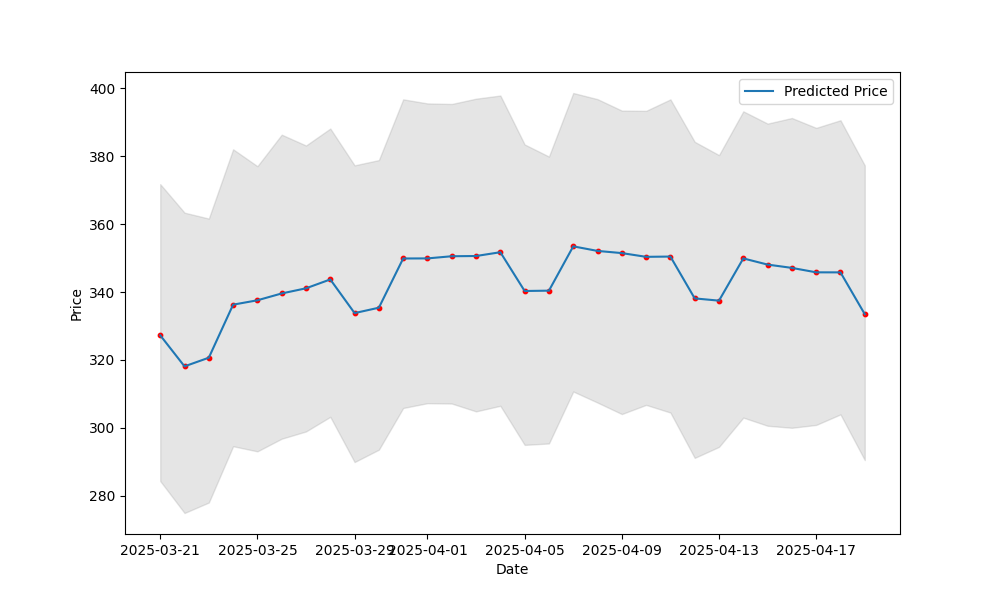

# Stock Analysis and Prediction with Prophet AI

This project utilizes Facebook's Prophet library to analyze and predict stock prices based on historical data. The goal is to provide a simple and effective tool for investors to use as a reference in their decision-making process.

## Installation

1.  Install Python 3.12 (recommended to use a virtual environment).

2.  Install the required libraries:

    ```bash
    pip install pandas prophet yfinance matplotlib
    ```

3.  Download stock data from a data source (e.g., Yahoo Finance).

## Usage

1.  Run the `predict_stock_prophet.py` file with the necessary parameters:

    ```bash
    python predict_stock_prophet.py <ticker> <start_date> <end_date>
    ```

    Where:
    * `<ticker>`: Stock ticker (e.g., AAPL, VNM).
    * `<start_date>`: Data start date (e.g., 2020-01-01).
    * `<end_date>`: Data end date (e.g., 2023-12-31).

2.  View the prediction results on the chart.
3. If you want to create the report images, you must run the python project first.

## Data

* Stock data is downloaded from Yahoo Finance using the `yfinance` library.
* The data includes open price, close price, high price, low price, and trading volume.
* Data is processed and prepared before being fed into the Prophet model.

## Prophet Model

* Uses Facebook's Prophet model to predict time series.
* The Prophet model can handle trends, seasonality, and holidays.
* The model is trained on historical data and used to predict future stock prices.

## Results

* The prediction results are presented on a chart.
* Evaluate model effectiveness using metrics such as MAE, MSE, RMSE.
* Results may vary depending on data and model parameters.

## Reports

Report images are generated of the project.



## Contributing

* All contributions are welcome.
* Please create a pull request to contribute to the project.
